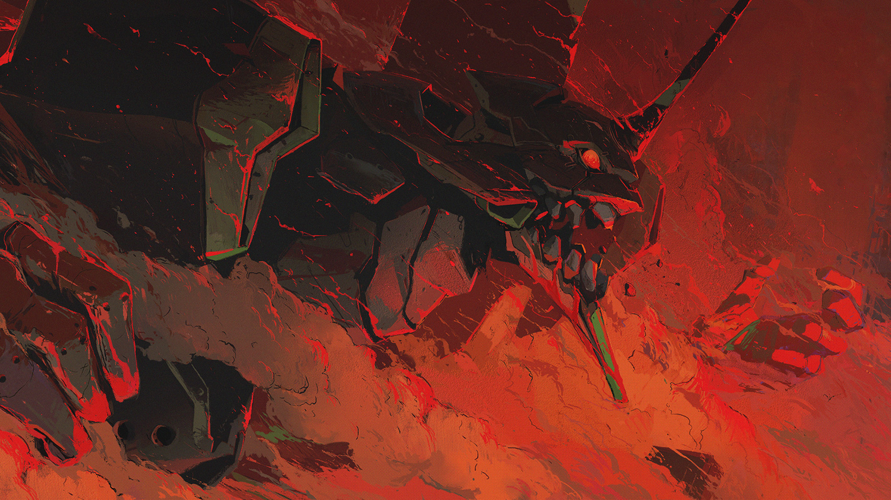
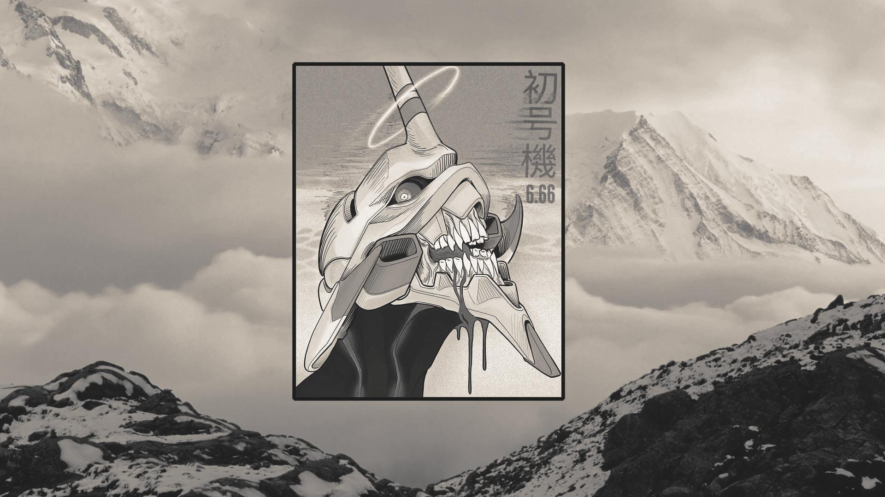
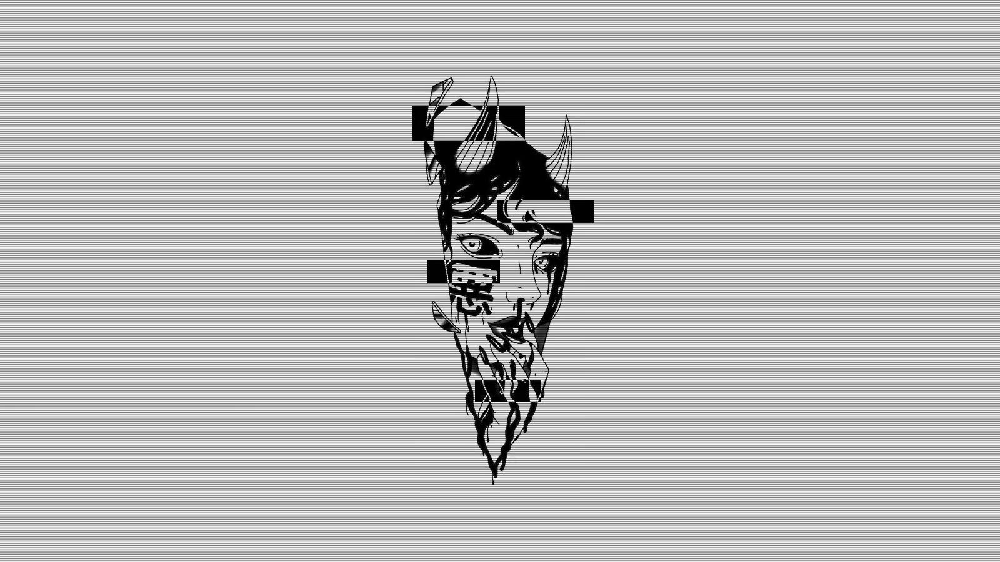
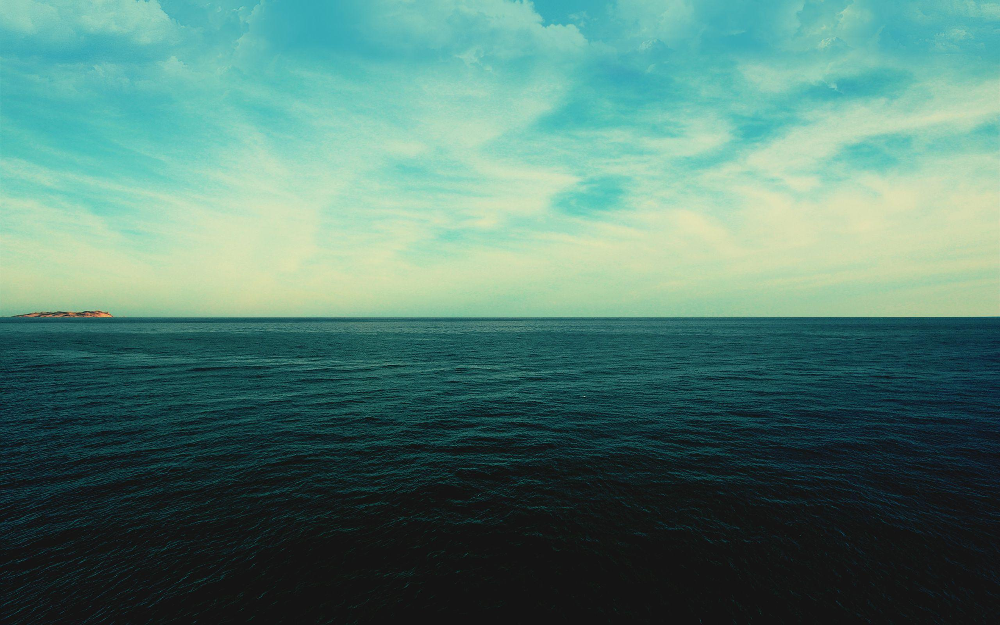
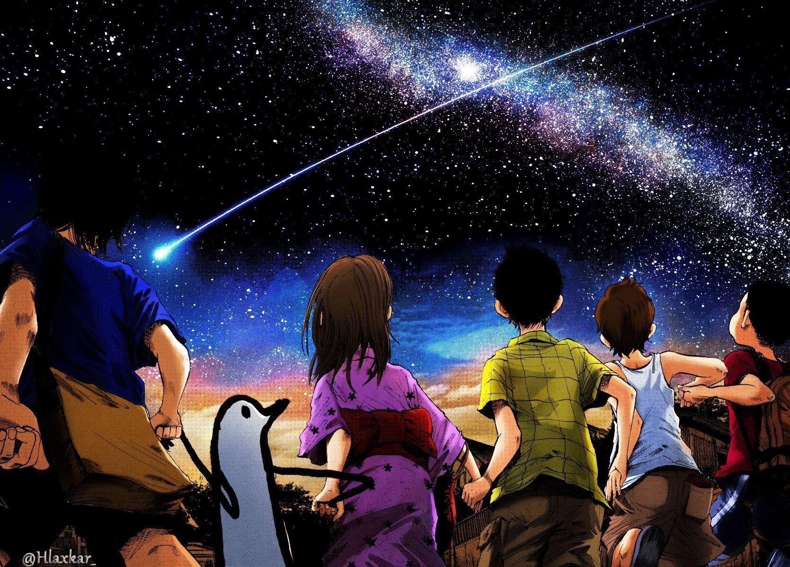
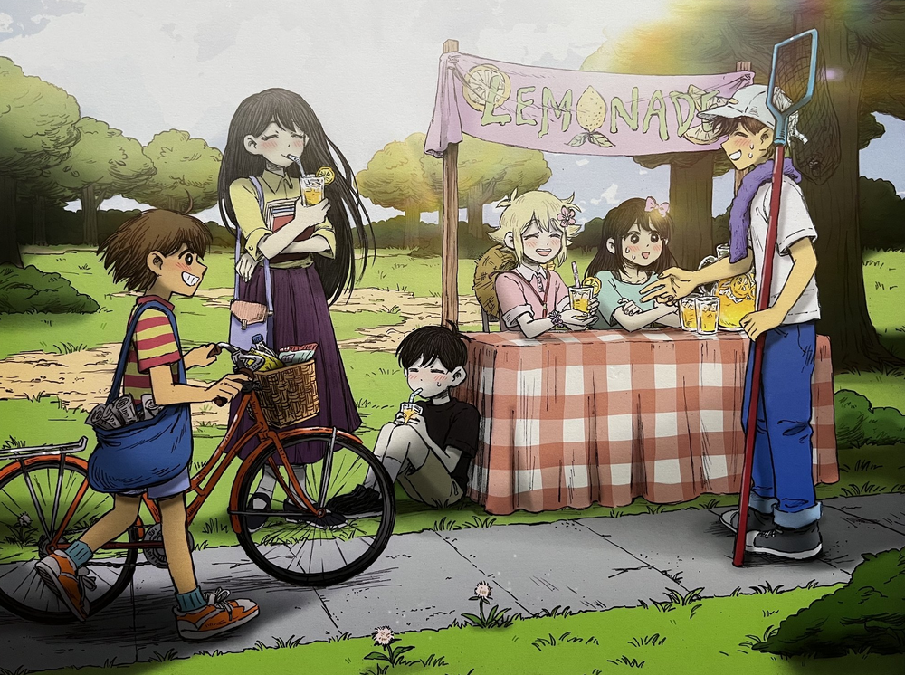
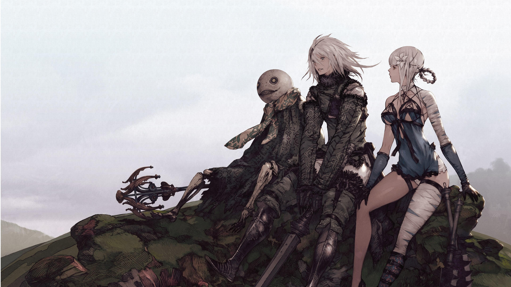

# Wallpapers

This README is auto-generated. You may view its source code [here](docgen.py).
Showcases are randomly chosen. Files are shuffled then first two
from each category are chosen.

You may use [download-directory](https://download-directory.github.io) for downloading a specific directory.

## Showcase

Categorized wallpaper showcase. two pictures per category.

## unsorted

  

  

[Browse](../unsorted/README.md)

## evangelion

  

  

[Browse](../evangelion/README.md)

## darksouls

  

  

[Browse](../darksouls/README.md)

## girls

  

  

[Browse](../girls/README.md)

## solarized

  

  

[Browse](../solarized/README.md)

## lain

  

  

[Browse](../lain/README.md)

## drawings

  

  

[Browse](../drawings/README.md)

## punpun

  

  

[Browse](../punpun/README.md)

## omori

  

  

[Browse](../omori/README.md)

## berserk

  

  

[Browse](../berserk/README.md)

## jinx

  

  

[Browse](../jinx/README.md)

## doom

  

  

[Browse](../doom/README.md)

## nier

  

  

[Browse](../nier/README.md)

## fog

  

  

[Browse](../fog/README.md)

## brockhofer

  

  

[Browse](../brockhofer/README.md)

## jjba

  

  

[Browse](../jjba/README.md)

## Sources

- <https://omori.fandom.com/wiki/MARI#CALENDAR/>
- <https://wallpaper.castorisdead.xyz/>
- <https://brockhoferart.com/>
- <https://wallhaven.cc/>
- <https://github.com/dharmx/walls/>
- I don't recall other

## Ownership

I do not own these images. All credits belong to the respective artists.
If you find an image hosted in this repository that is yours and of limited
use, please let me know and I will remove it.
