# berserk

<a href="cyberpunk.webp">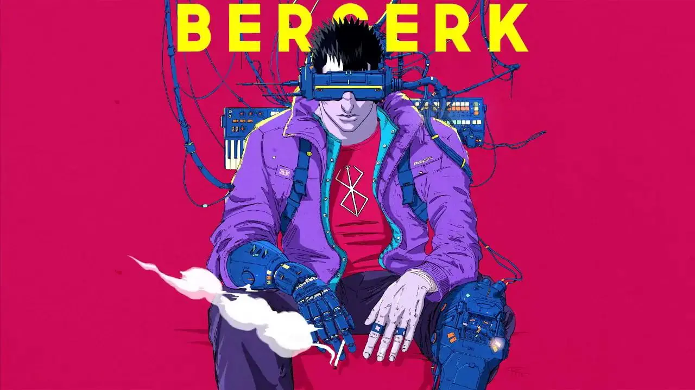</a>

<a href="god-hand.webp">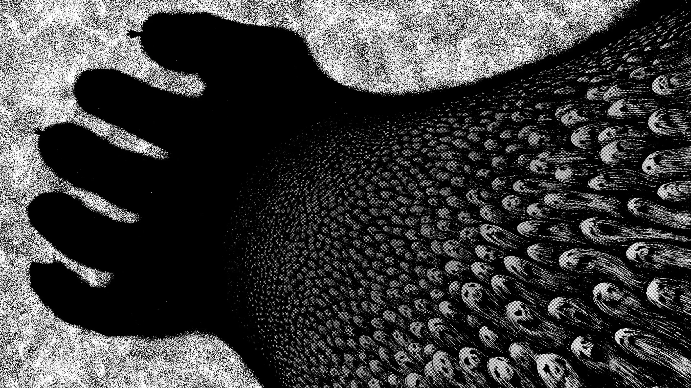</a>

<a href="skull-knight-femto.webp">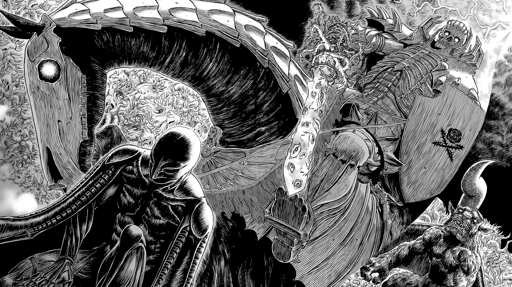</a>

<a href="griffith-portrait.webp">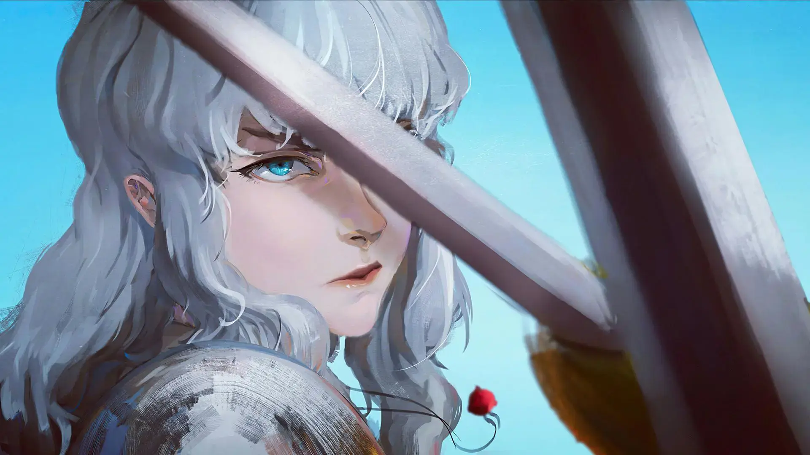</a>

<a href="wallhaven-x6yr1l.webp">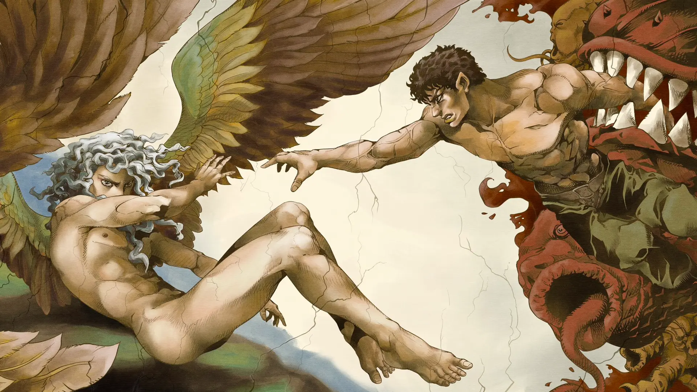</a>

<a href="guts.webp">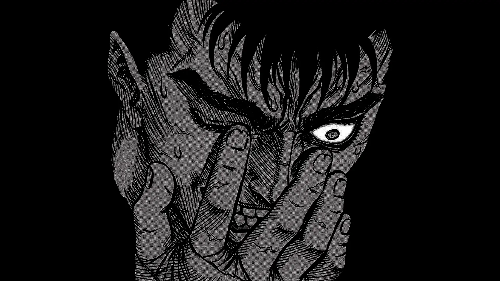</a>

<a href="guts-scream.webp">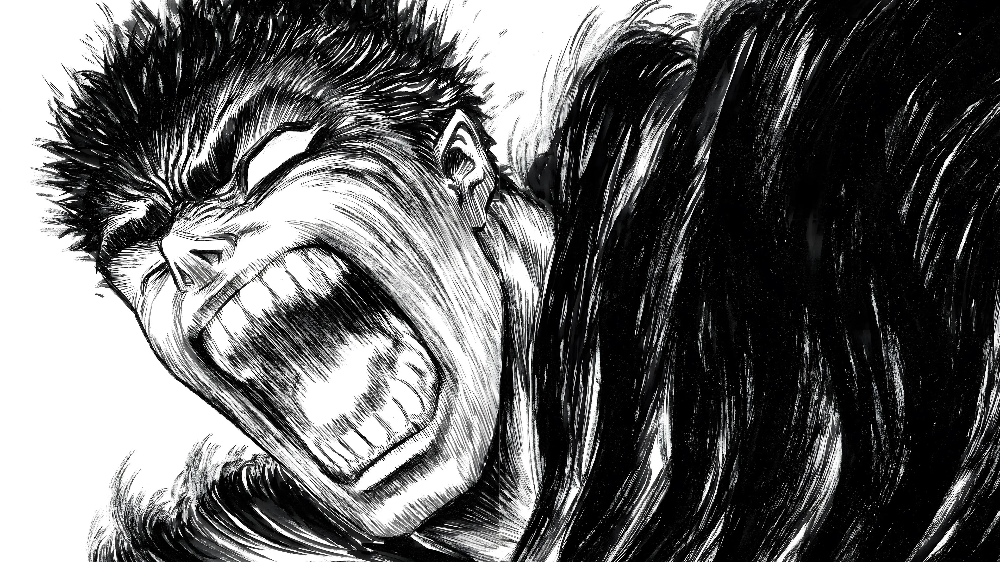</a>

<a href="wallhaven-jexvkm.webp">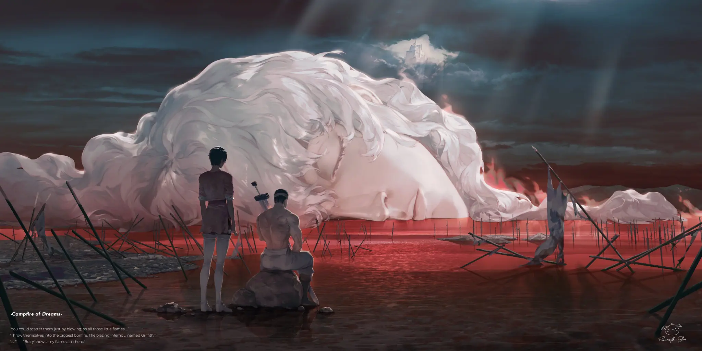</a>

<a href="berserker-armor-stylized.webp">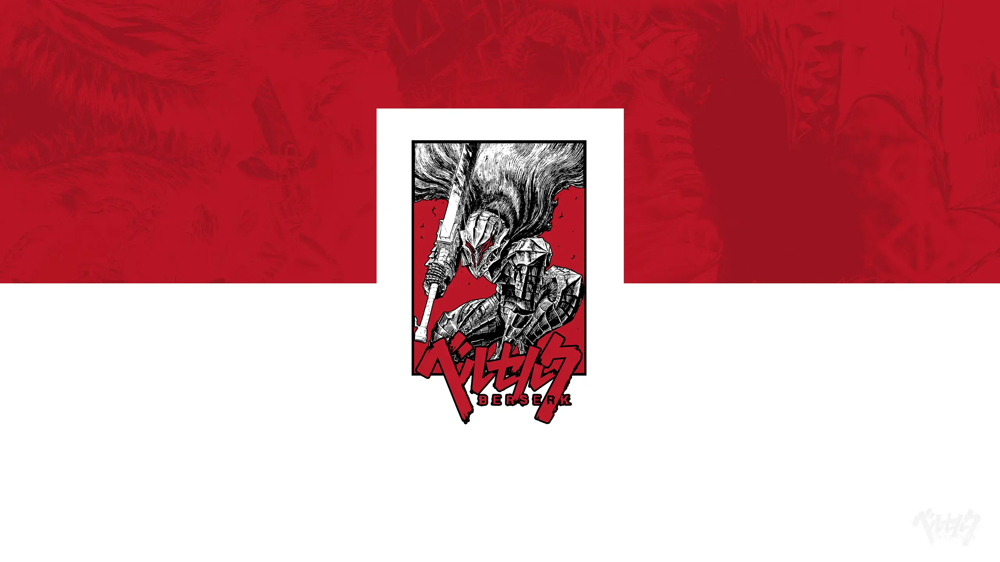</a>

<a href="berserkgame.webp">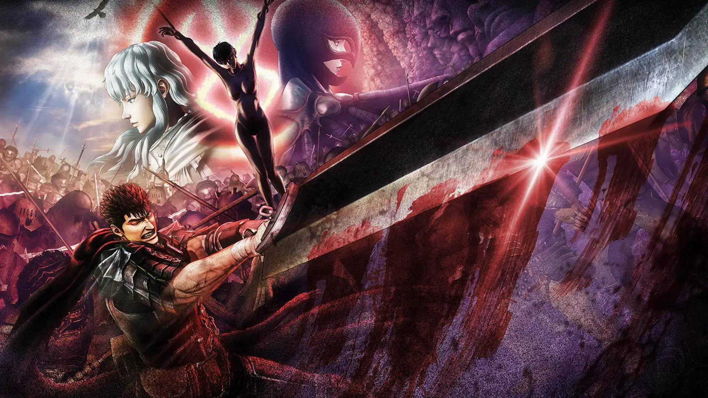</a>

<a href="guts-and-sky.webp">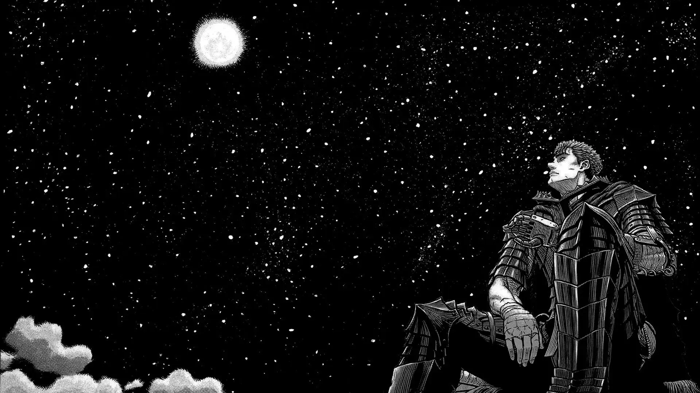</a>

<a href="Schierke.webp">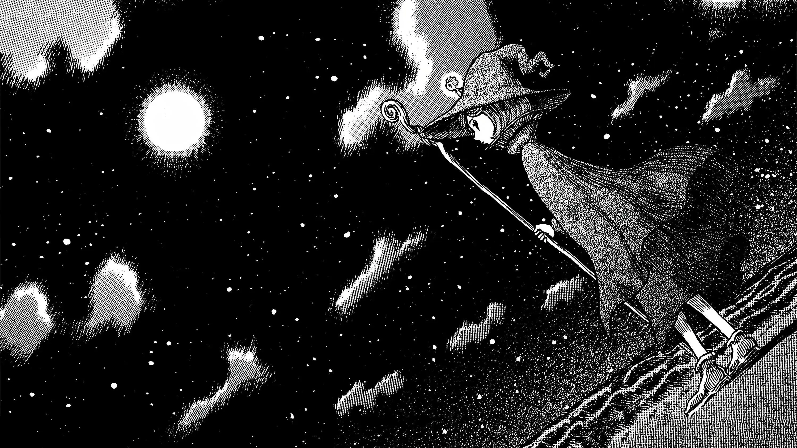</a>

<a href="spirit.webp">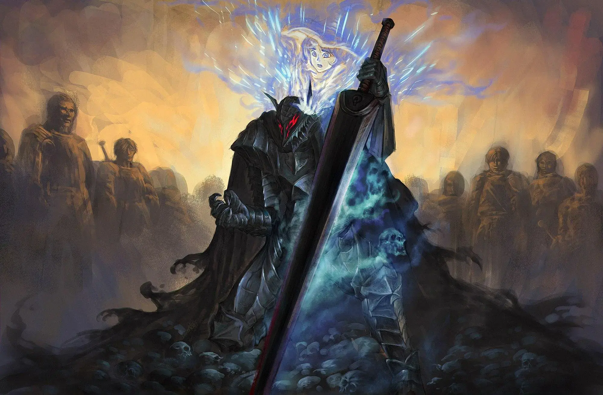</a>

<a href="wallhaven-ogl9l7.webp">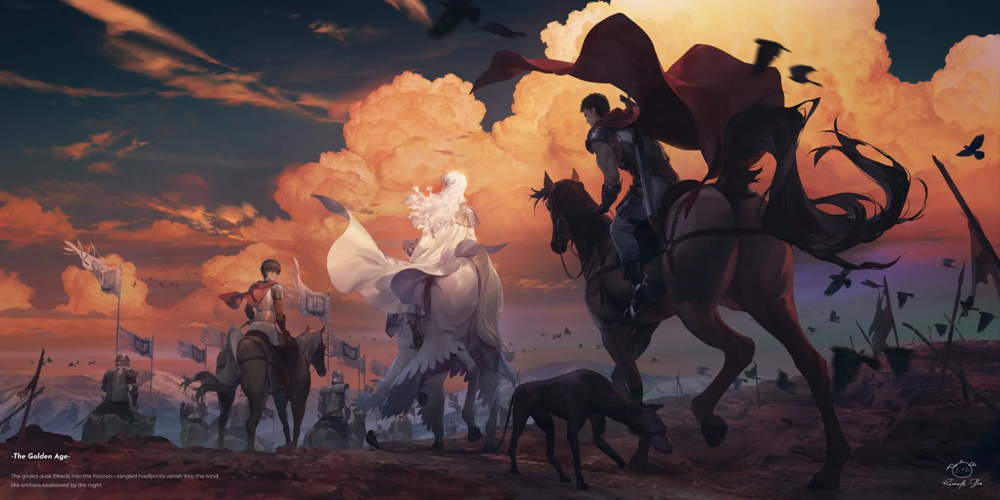</a>

<a href="guts-eclipse-faces.webp">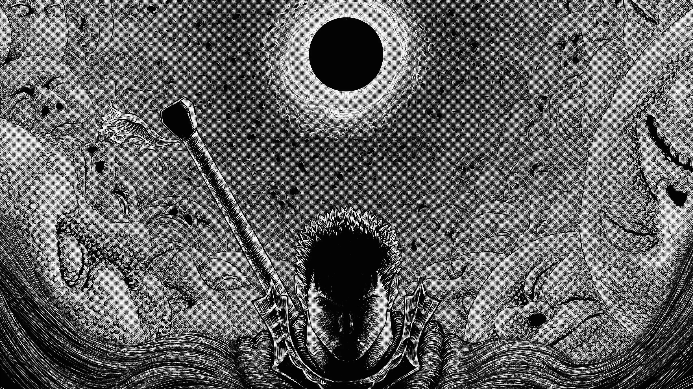</a>

<a href="wolf.webp">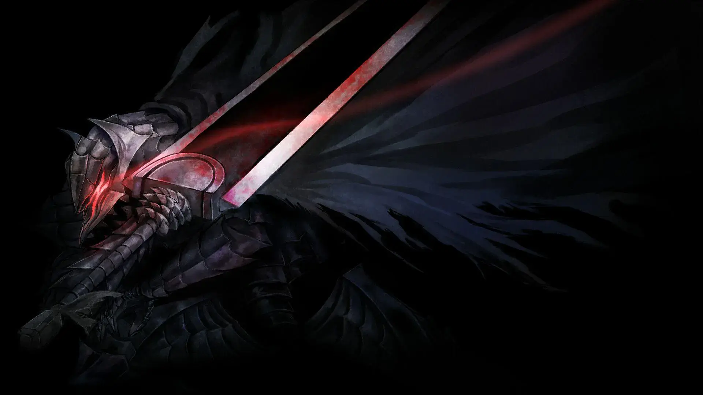</a>

<a href="eclipse.webp">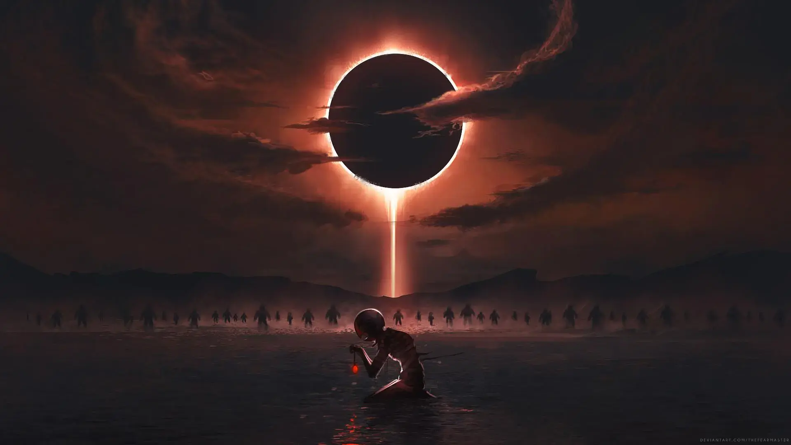</a>

<a href="guts2.webp">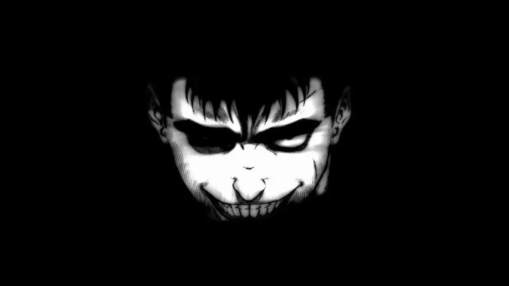</a>

