# brockhofer

<a href="HyperBeast1.webp">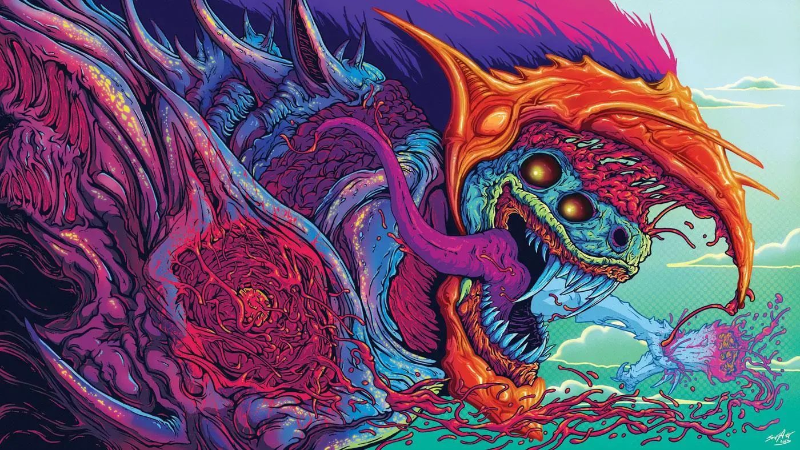</a>

<a href="HyperBeast5.webp">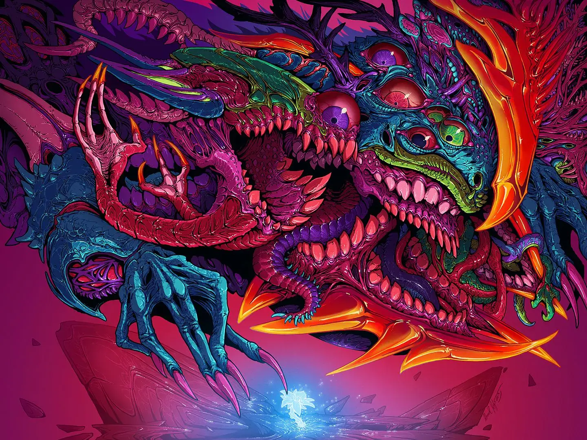</a>

<a href="TheBlueMist.webp">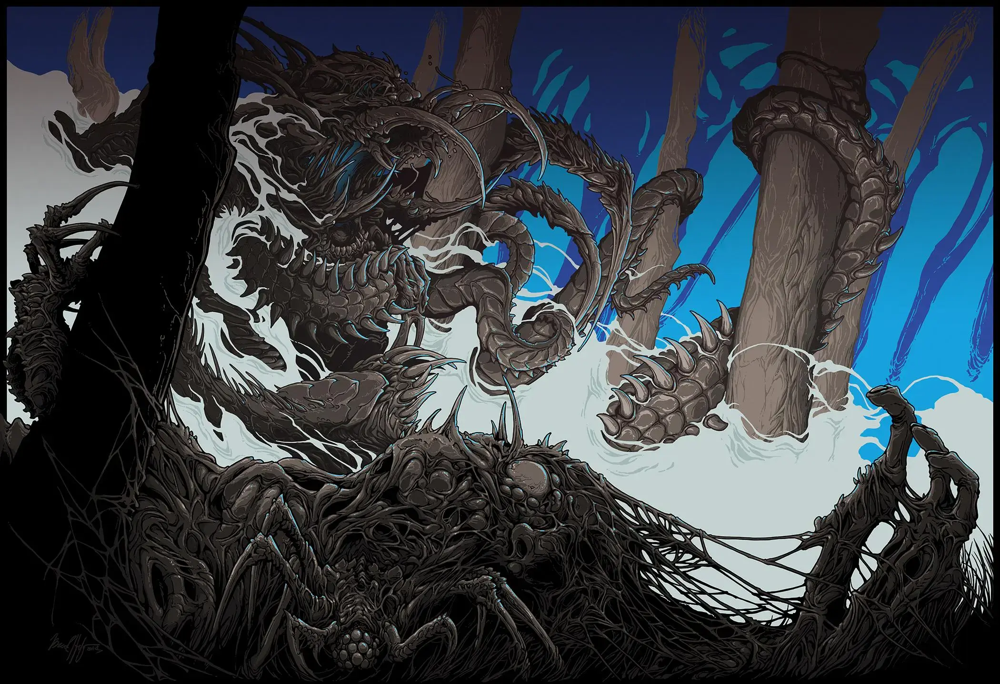</a>

<a href="TheRedMist.webp">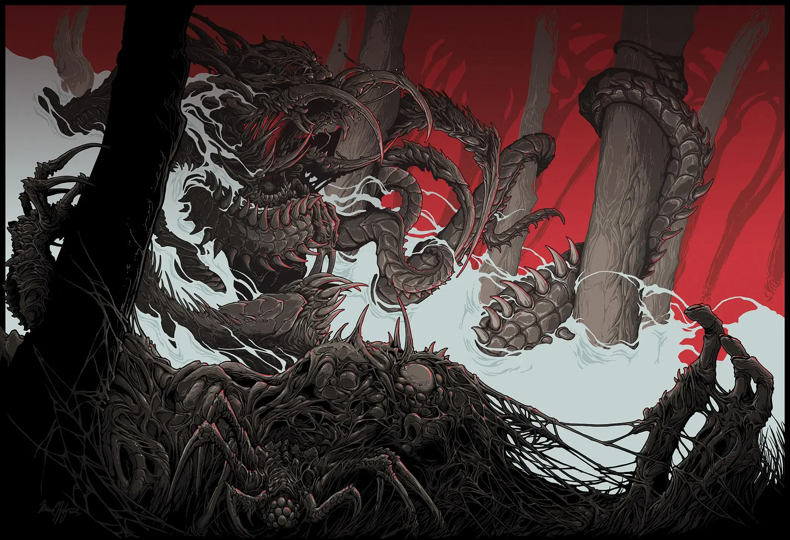</a>

<a href="CalamityBeast.webp">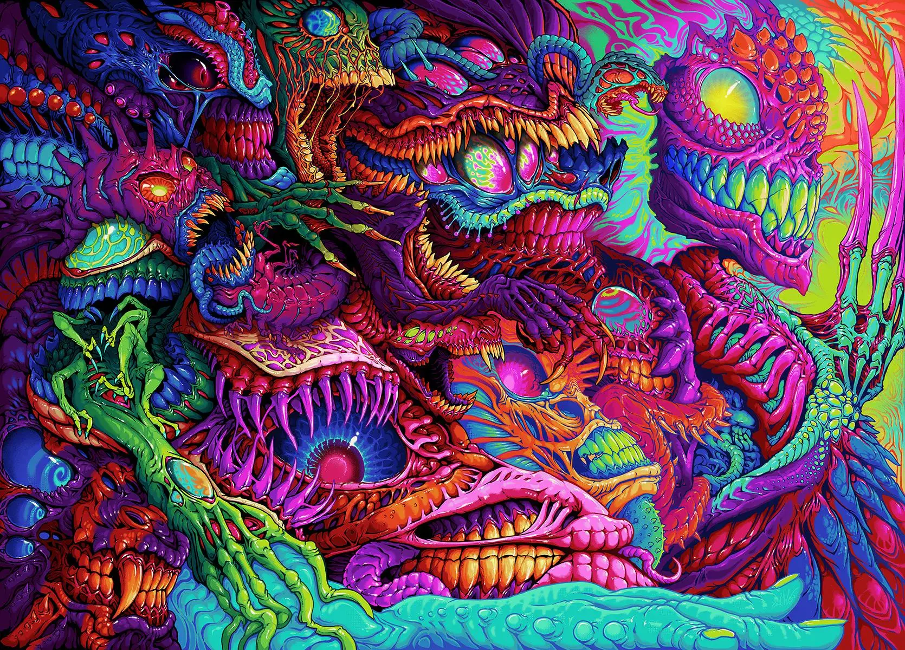</a>

<a href="PsychoGoreman.webp">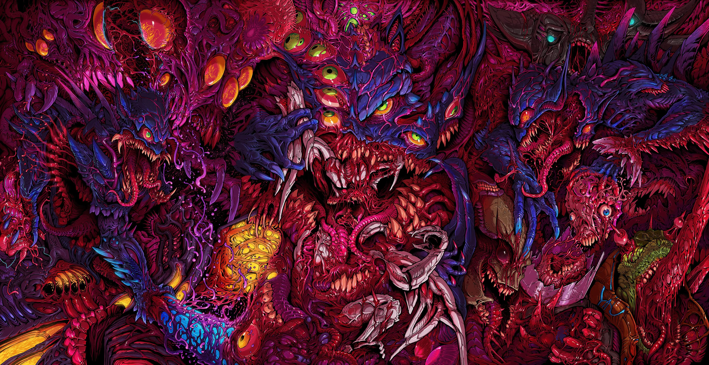</a>

<a href="HyperBeast7.webp">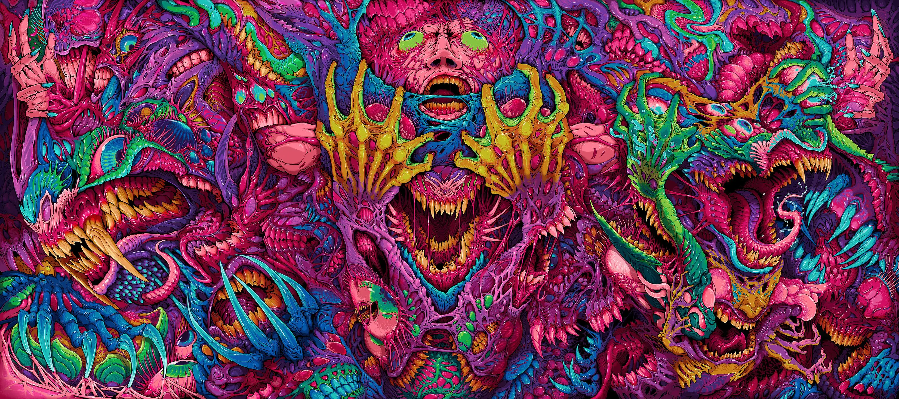</a>

<a href="HyperBeast3.webp">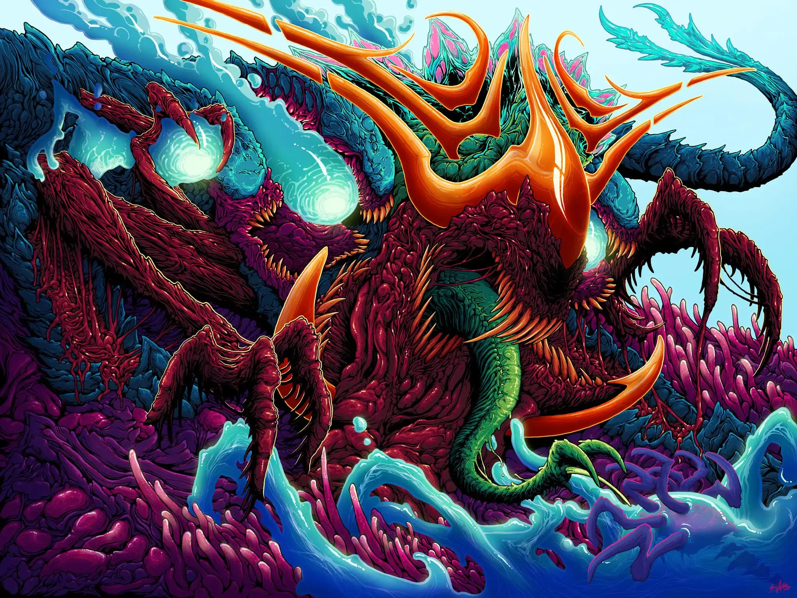</a>

<a href="intel.webp">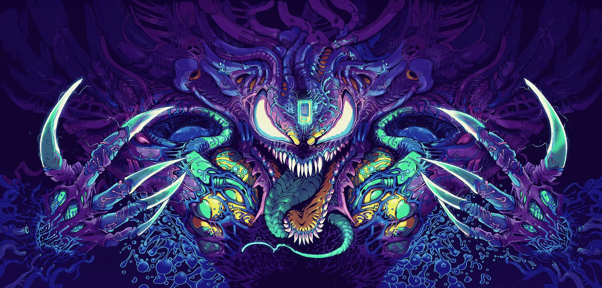</a>

<a href="OrganOpera.webp">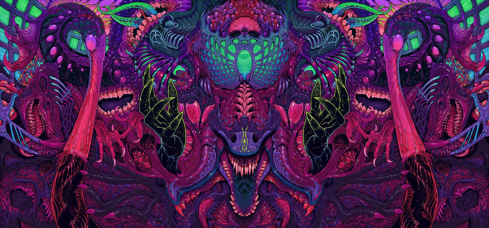</a>

<a href="HyperBeast6.webp">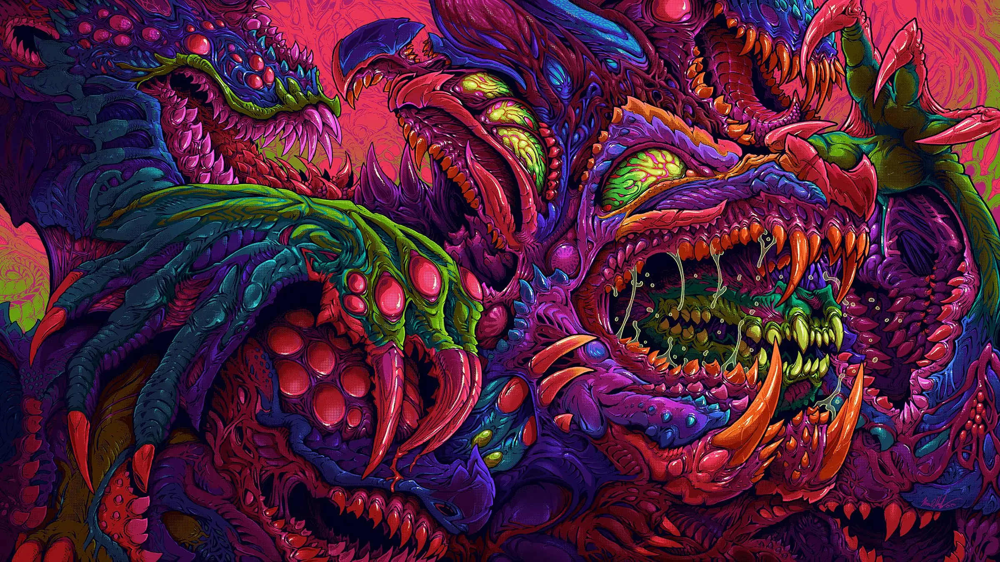</a>

<a href="Arozzi.webp">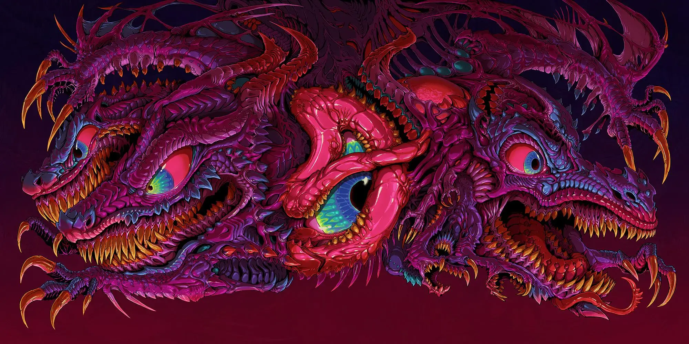</a>

