# darksouls

<a href="wallhaven-769y2o.webp">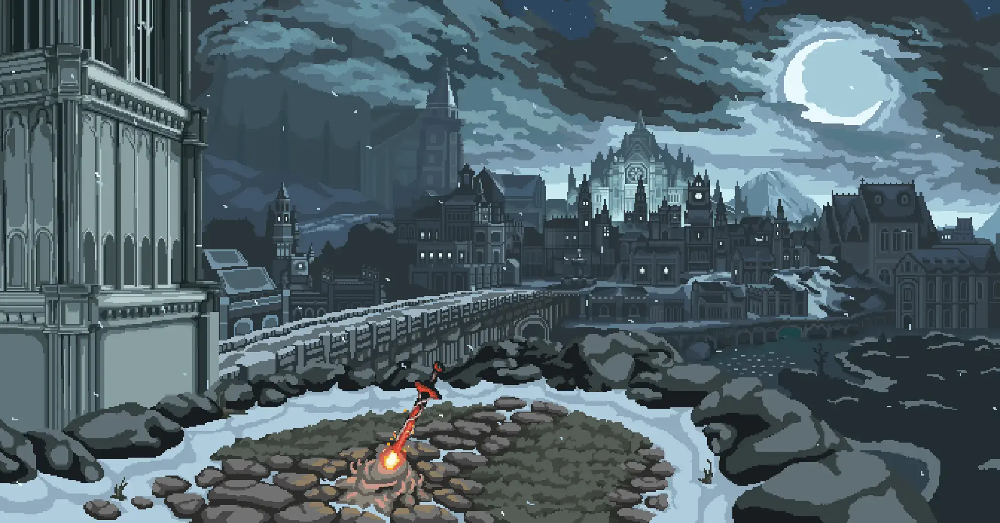</a>

<a href="Elden_Ring_Landscape_2.webp">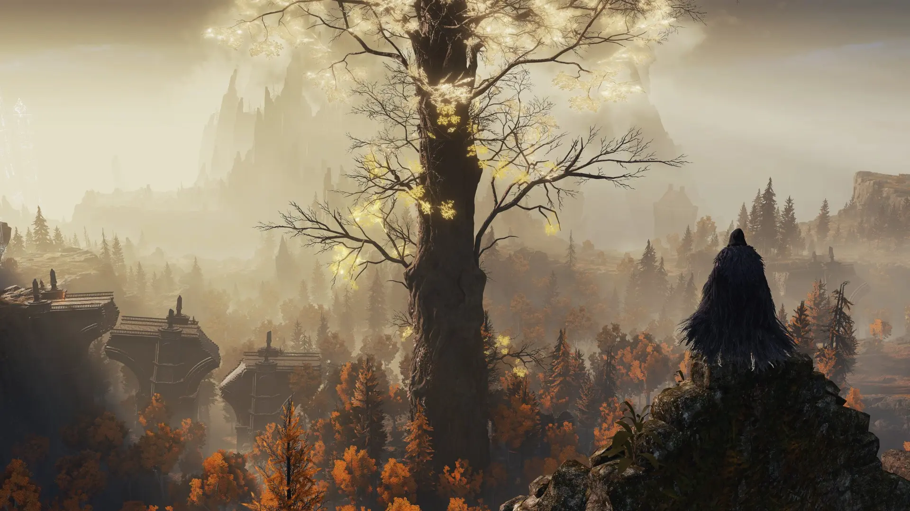</a>

<a href="Elden_Ring_Castle.webp">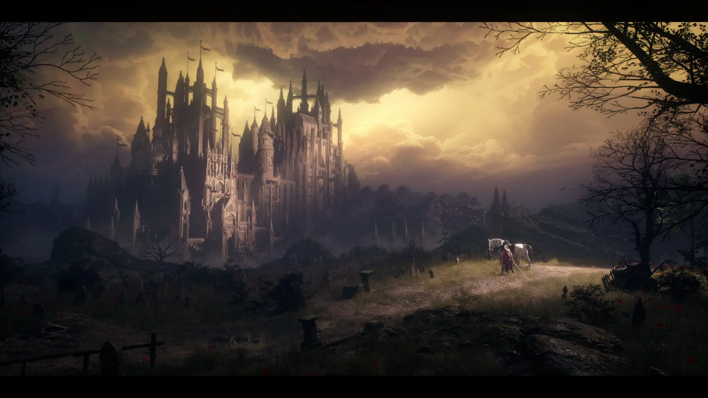</a>

<a href="wallhaven-x19qdz.webp">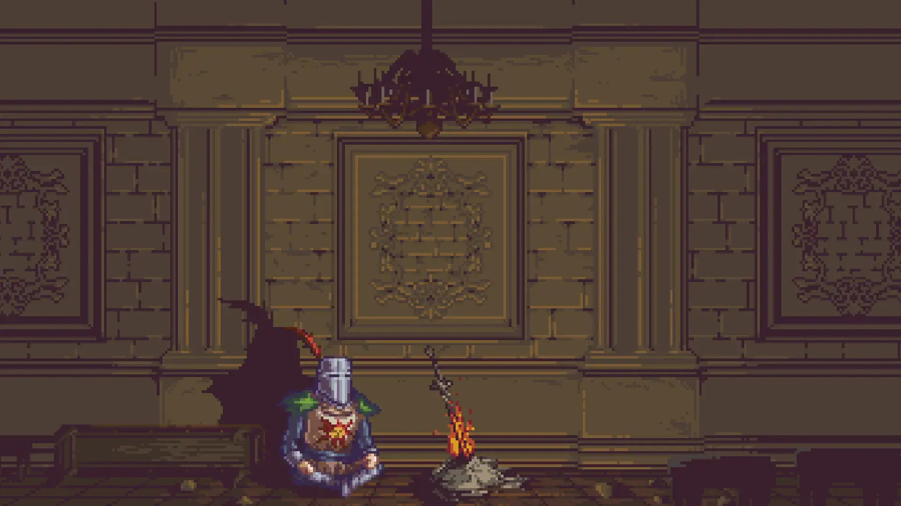</a>

<a href="soul-of-cinder-swords.webp">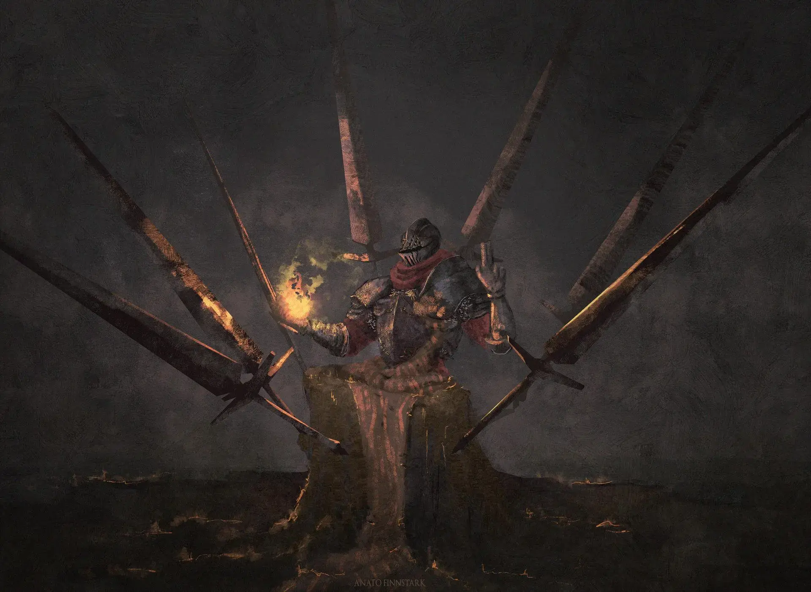</a>

<a href="wallhaven-57qm99.webp">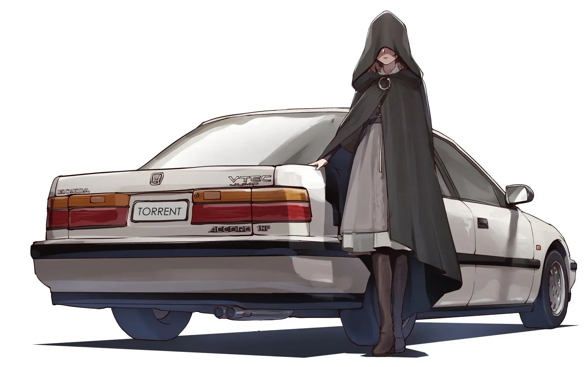</a>

<a href="soulofcinder.webp">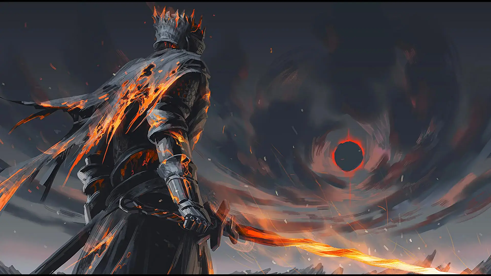</a>

<a href="wolf-gruvbox.webp">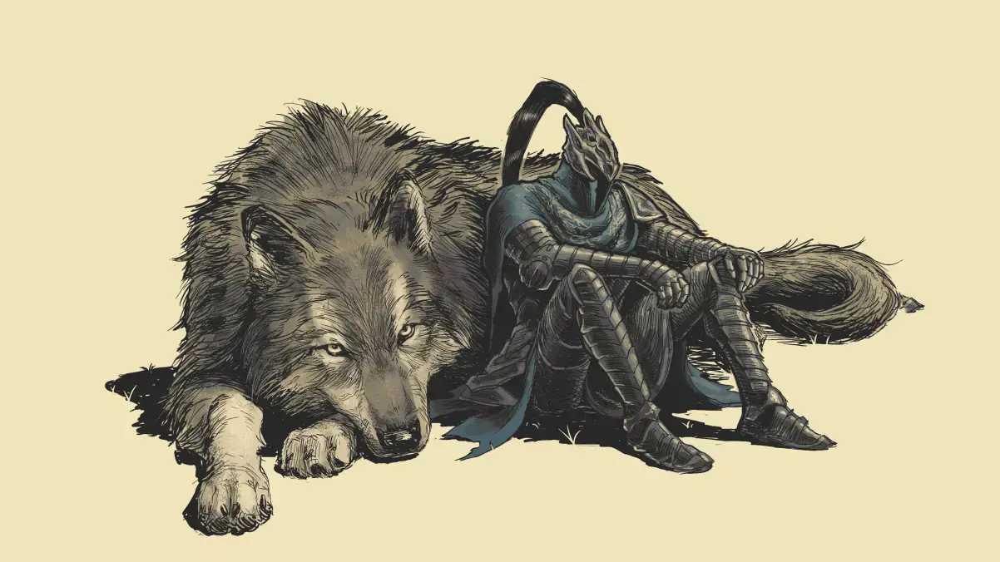</a>

<a href="Dark-Souls-III.webp">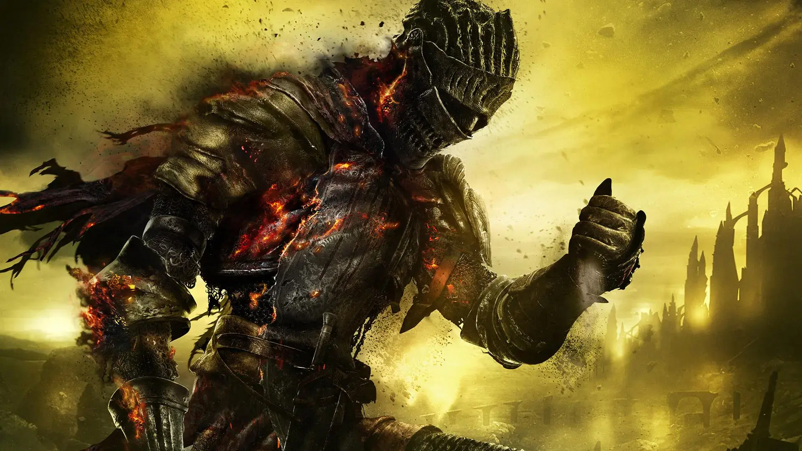</a>

<a href="Elden_Ring_Landscape_3.webp">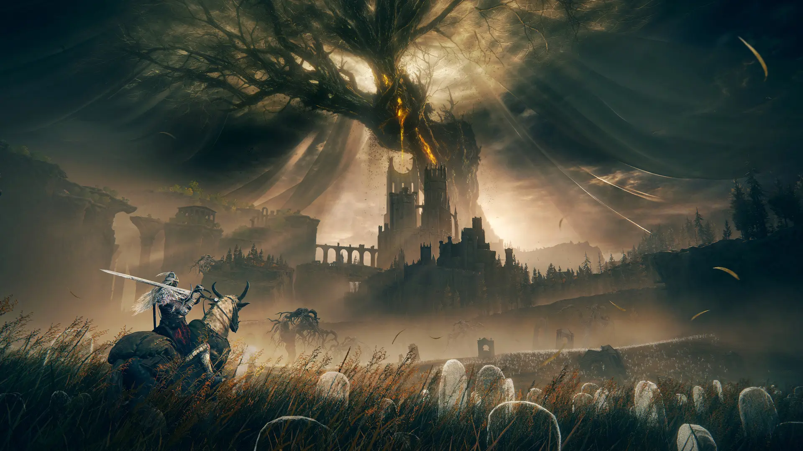</a>

<a href="wolf.webp">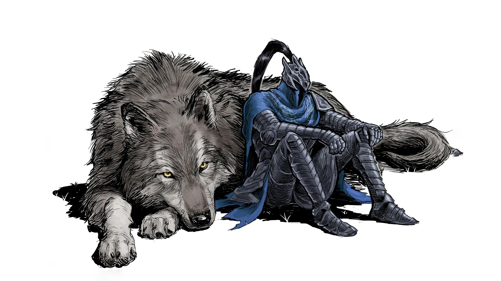</a>

<a href="wallhaven-3zj9wy.webp">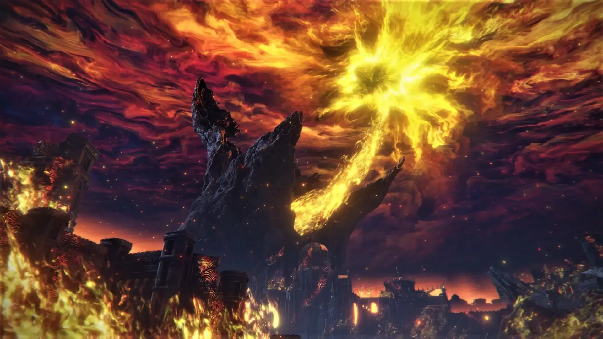</a>

<a href="wallhaven-2yzg1g.webp">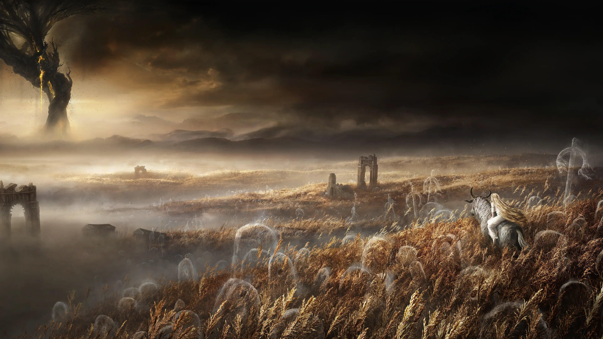</a>

<a href="wallhaven-72k6py.webp">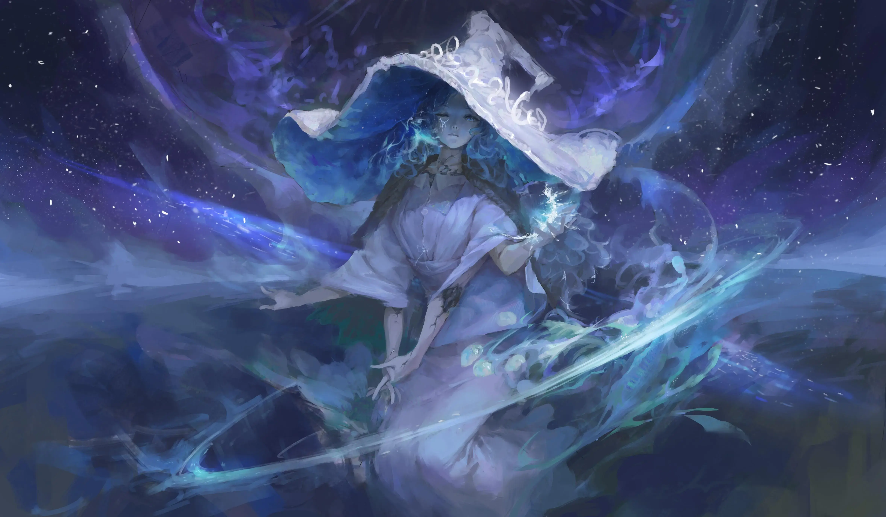</a>

<a href="Elden_Ring_Landscape.webp">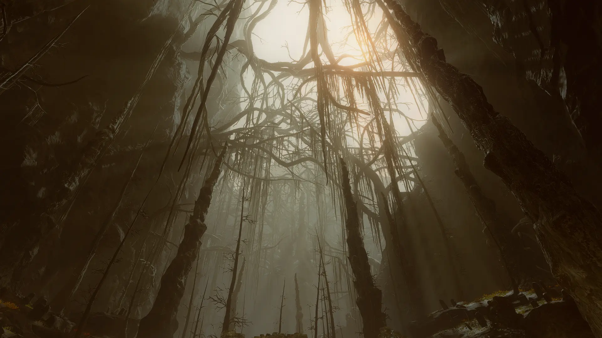</a>

<a href="trilogy.webp">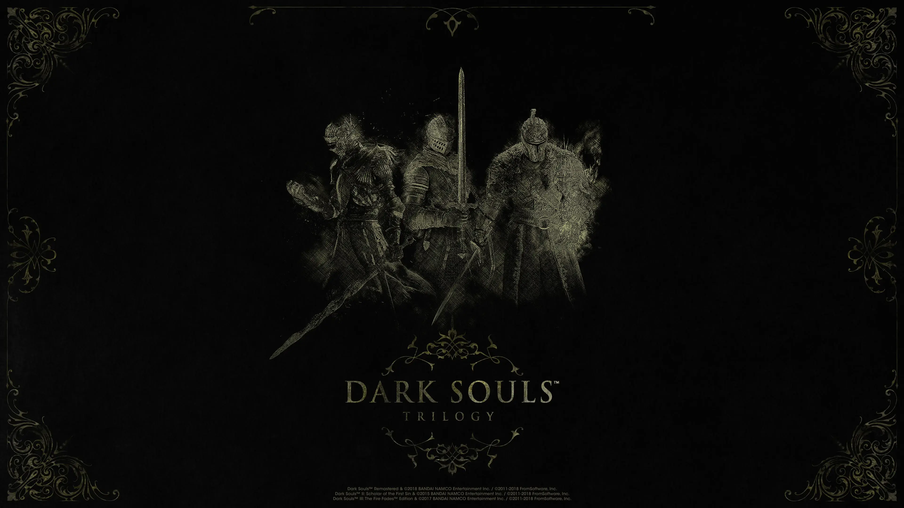</a>

<a href="wallhaven-8x3eej.webp">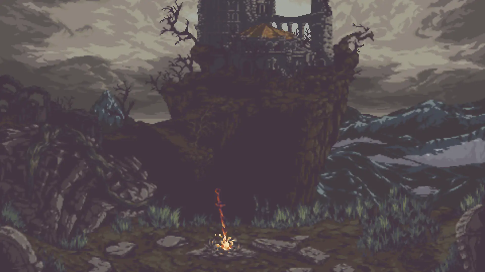</a>

