# jjba

<a href="jotaro3.webp">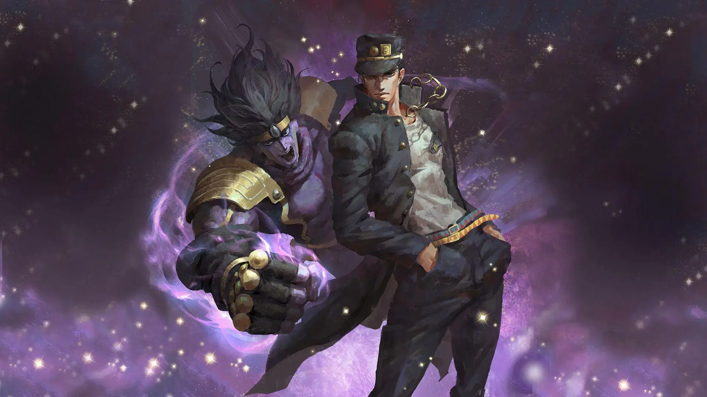</a>

<a href="josuke2.webp">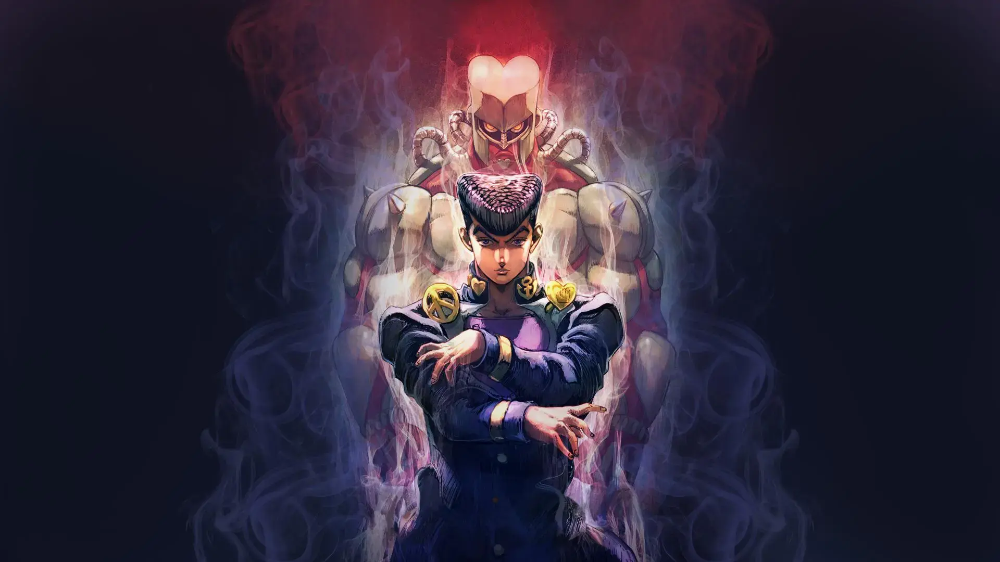</a>

<a href="jojo4.webp">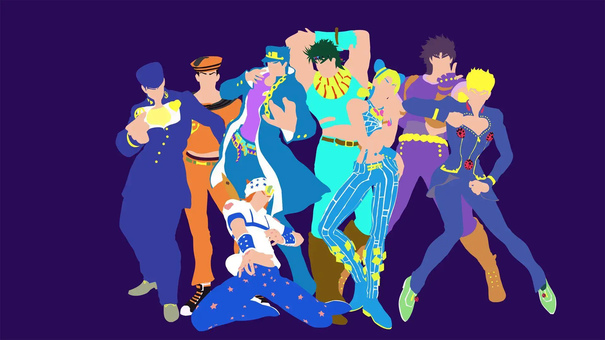</a>

<a href="josuke.webp">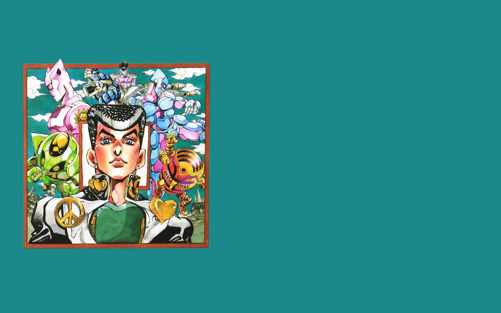</a>

<a href="jotarovsdio.webp">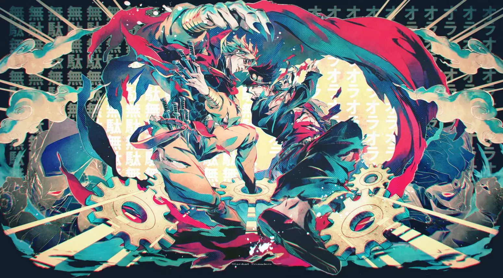</a>

<a href="stardustcrusaders.webp">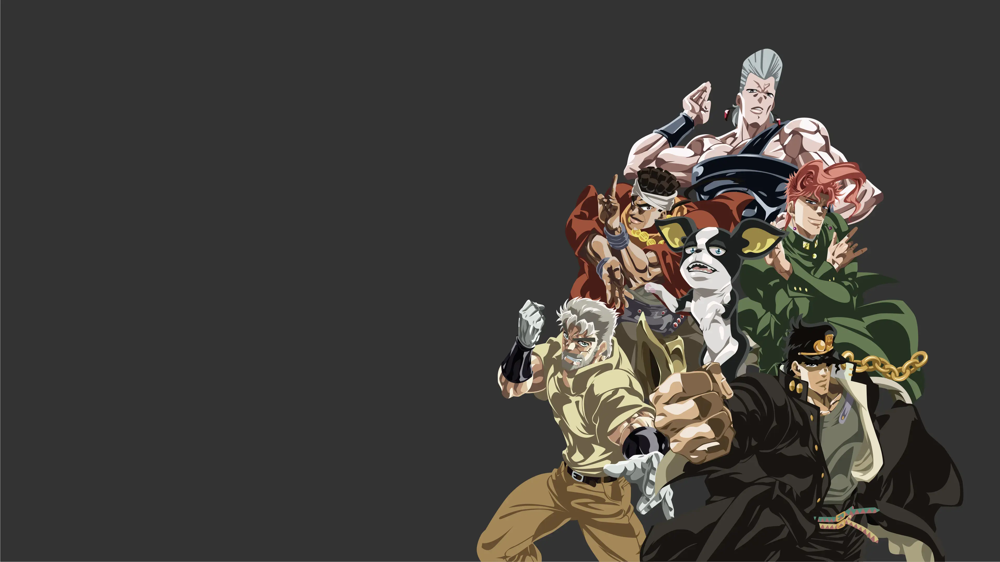</a>

<a href="jojo5.webp">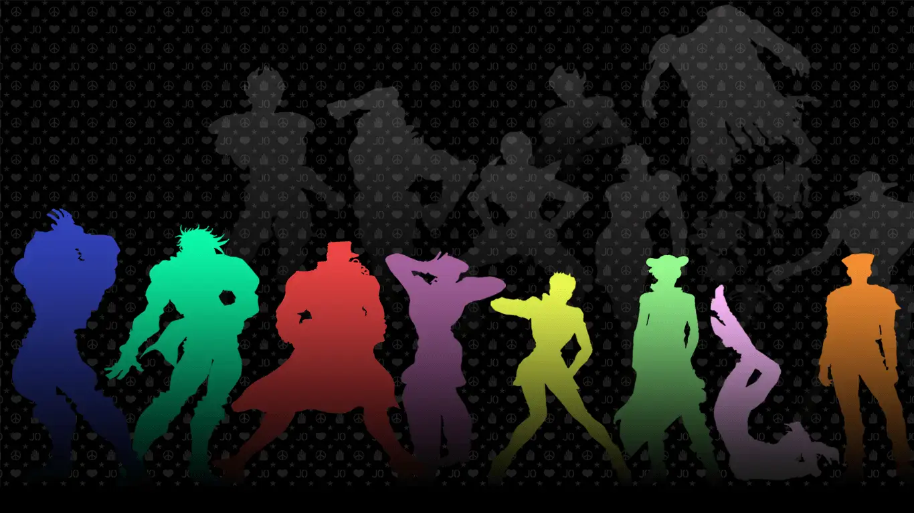</a>

<a href="dio.webp">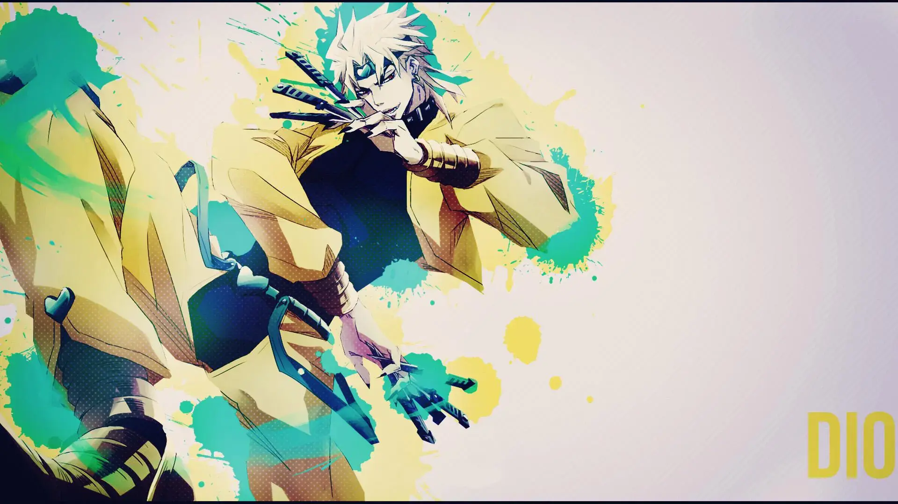</a>

<a href="jojo2.webp">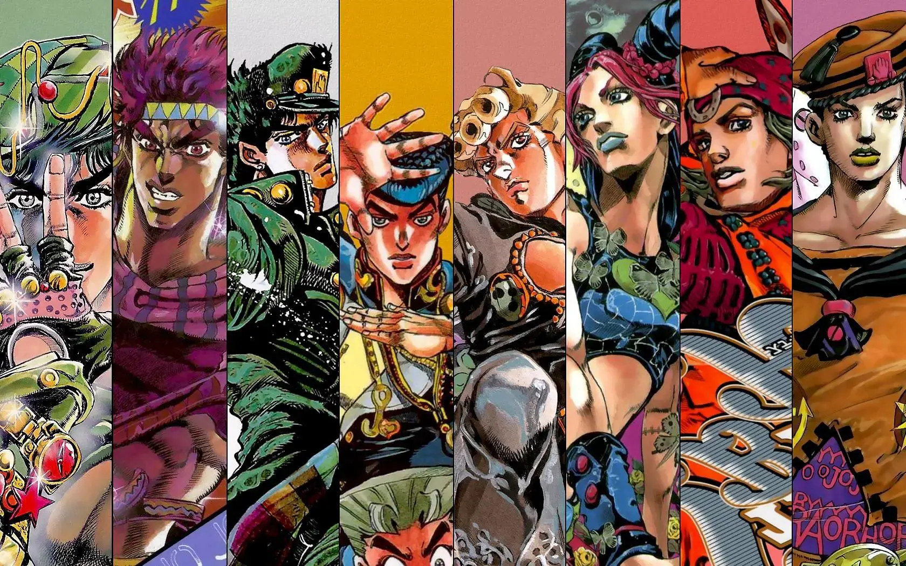</a>

<a href="jojolion.webp">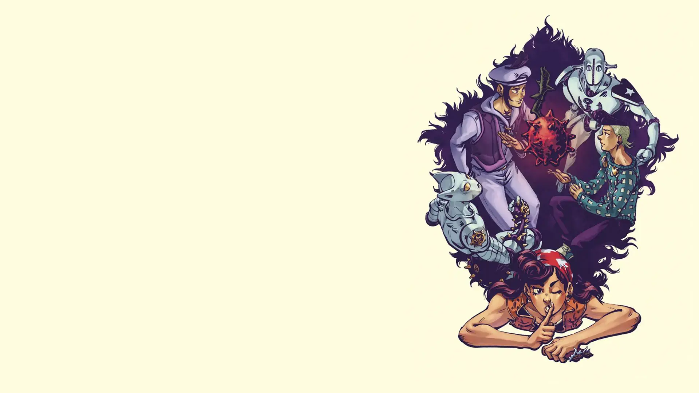</a>

<a href="jotaro2.webp">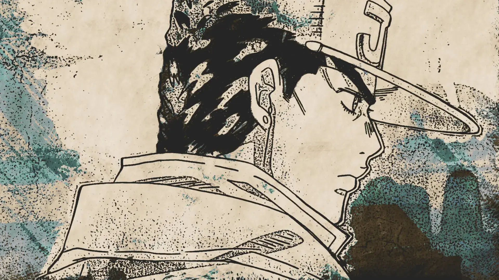</a>

